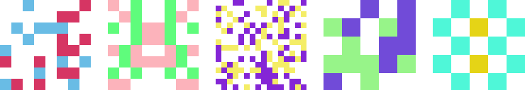

# squareicon

[](https://www.npmjs.com/package/squareicon)
[](https://www.jsdelivr.com/package/npm/squareicon)
[](https://bundlephobia.com/result?p=squareicon)
[](https://github.com/mistic100/squareicon/actions)

JavaScript library for generating abstract images from unique identifiers.




## Demo

https://mistic100.github.io/squareicon


## Installation

```
$ npm install squareicon
```

### Dependencies

- [randomcolor](https://www.npmjs.com/package/randomcolor) - for color schemes other than `raw`
- [canvas](https://www.npmjs.com/package/canvas) - only when using NodeJS


## Usage

### In browser

```html
<script src="randomcolor/randomColor.js"></script>
<script src="squareicon/browser.js"></script>

</div>

<script>
    squareicon({ id: 'mistic100' }, (err, data) => {
        document.querySelector('img').src = data;
    });

    squareicon({ id: 'mistic100'})
        .then(data => {
            document.querySelector('img').src = data;
        });
</script>
```

### In NodeJS

```js
const fs = require('fs');
const squareicon = require('squareicon');

squareicon({ id: 'mistic100' }, (err, buffer) => {
    fs.writeFileSync('mistic100.png', buffer);
});

squareicon({ id: 'mistic100'})
    .then(data => {
        fs.writeFileSync('mistic100.png', buffer);
    });
```

### Command line

```
$ squareicon --id mistic100 mistic100.png
```


## Options

| Option | Default | Description |
| ------ | ------- | ----------- |
| id | null |input identifier, can be empty for random value |
| hasher | sha1<sup>1</sup> | function used to transform the id into an hexadecimal string |
| colors | 2 | number of colors, can only be 1 or 2 |
| pixels | 8 | number of pixels, between 2 and 16 |
| size | 128 | desired size<sup>2</sup>, between `pixels` and 2048 |
| padding | 0 | desired padding, between 0 and `size / 3` |
| symmetry | none | type of symmetry, one of `none`, `vertical`, `horizontal`, `central` |
| scheme | standard | colors scheme<sup>3</sup>, one of `raw`, `standard`, `light`, `bright`, `dark` |
| background | transparent | background color as a CSS string |

> <sup>1</sup> It uses the [crypto module](https://nodejs.org/api/crypto.html) on NodeJS and the [SubtleCrypto API](https://developer.mozilla.org/en-US/docs/Web/API/SubtleCrypto/digest) on the browser.
> 
> <sup>2</sup> The final size might be different in order to be pixel perfect
>
> <sup>3</sup> `raw` will directly use the 12 or 24 first bytes of the hash to create colors. Other modes are delegated to [randomcolor](https://www.npmjs.com/package/randomcolor).


## License
This library is available under the MIT license.
